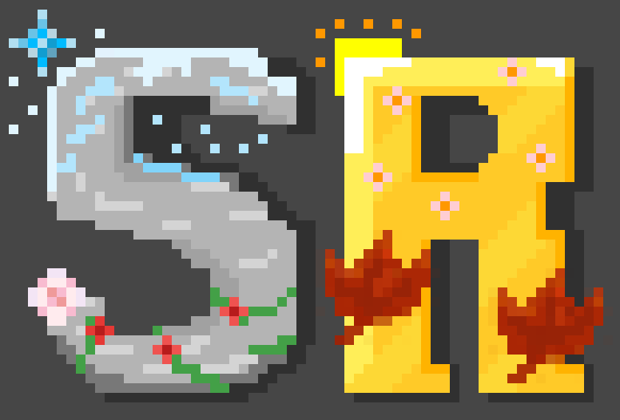

  

# Serene Regions

**Compatibility between [Serene Seasons](https://www.curseforge.com/minecraft/mc-mods/serene-seasons) and [Regions Unexplored](https://www.curseforge.com/minecraft/mc-mods/regions-unexplored).**

`Forge` · `Minecraft 1.20.1` · `MIT`

Regions Unexplored adds 30+ new trees and a couple of crops. Serene Seasons decides what may grow, and when. On their own, the two mods don't talk to each other: every Regions Unexplored plant grow anywhere at any time, and it's not very immersive seeing a palm tree sprouting in a snowstorm.

Serene Regions is here to fix that! Every Regions Unexplored sapling and crop gets the season (or seasons) it actually belongs to, and every Regions Unexplored biome gets classified so seasons behave sensibly inside it.

---

## Features

**🌱 Seasonal growth for every Regions Unexplored sapling and crop.**
All 33 saplings, plus the duskmelon and salmonberry, are assigned the seasons in which they're allowed to grow.

**🌴 Wet and dry seasons in the tropics.**
Regions Unexplored's 12 tropical biomes: rainforests, deserts and savannas are tagged tropical, so they run Serene Seasons' wet/dry cycle instead of the four-season one. No winter at the equator, summer crops there grow year-round.

---

## Requirements

| | |
|---|---|
| Minecraft | 1.20.1 |
| Forge | 47+ |
| [Serene Seasons](https://www.curseforge.com/minecraft/mc-mods/serene-seasons) | 9.1+ |
| [Regions Unexplored](https://www.curseforge.com/minecraft/mc-mods/regions-unexplored) | 0.5.6+ |

This is my first mod. That's why at least for now it's only for Forge 1.20.1, as Regions Unexplored got deprecated for this version and won't receive updates like additional crops (what makes this easy to maintain). I'm planning on adding support for the later versions by maybe even contributing code to the Regions Unexplored mod itself, so Serene Regions may not even be needed for future versions of the game!

---

## Credits

Built by **demolutio**, artwork by **luisaava**.

All credit for the seasons and the biomes themselves goes to the [Serene Seasons](https://github.com/Glitchfiend/SereneSeasons) and [Regions Unexplored](https://github.com/UHQ-GAMES-MODS/RegionsUnexplored) teams.
